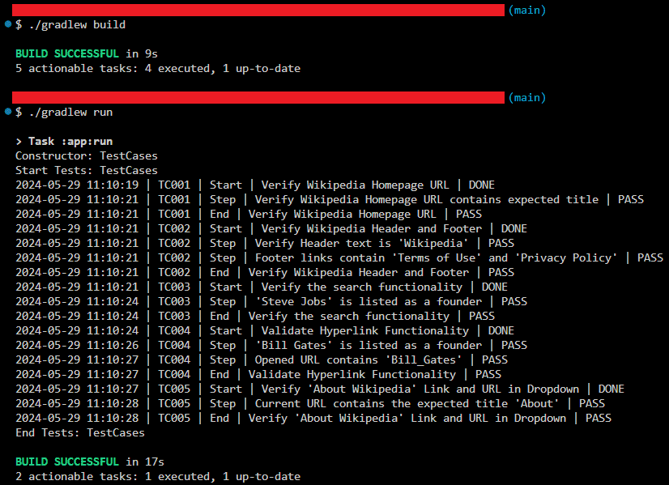

# Wikipedia Automation

`Selenium` `Xpath`

---

This project involves automating the search feature of [Wikipedia](https://www.wikipedia.org) to validate certain factual data, such as the name of the founder of certain organizations, as well as validating other basic functionalities.

---

# Overview
This project involves automating the search feature of [Wikipedia](https://www.wikipedia.org) to validate certain factual data, such as the name of the founder of certain organizations, as well as validating other basic functionalities.

# Automating Wikipedia
## Scope of work
* Automated the following test cases:
    * Verify Wikipedia Homepage URL
    * Verify Wikipedia Header and Footer
    * Verify the search functionality
    * Validate Hyperlink Functionality
    * Verify 'About Wikipedia' Link and URL in Dropdown

## Skills used
`Selenium` `Xpath`

---

# Screenshots

